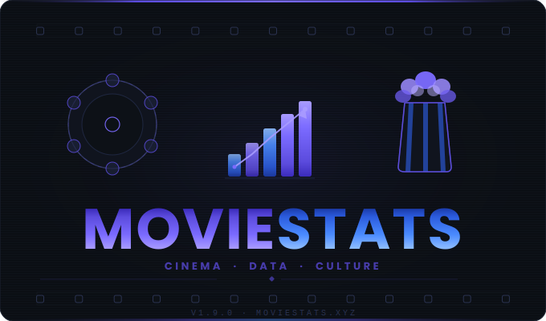

<p align="center">
  
</p>

<p align="center">


</p>

> A personal movie library powered by **TMDB** and **fanart.tv** — search any film, save it to your local collection, and explore rich metadata, HD artwork, cast, crew, and more through a sleek dark web UI.

---

## Table of Contents

- [Features](#features)
- [Tech Stack](#tech-stack)
- [Project Structure](#project-structure)
- [Quick Start](#quick-start)
- [API Keys](#api-keys)
- [Usage](#usage)
- [Roadmap](#roadmap)
- [Contributing](#contributing)
- [License](#license)

---

## Features

- **Multi-User Accounts** — JWT-based authentication with secure bcrypt password hashing; each user has a private movie library
- **Personal Lists** — Favorites, Watchlist, and unlimited custom lists to organize your collection
- **TMDB Search** — find any movie by title, TMDB ID, or IMDb ID
- **HD Artwork** — posters, backdrops, logos, disc art, banners via fanart.tv
- **Full Metadata** — title, tagline, overview, runtime, release date, rating, vote count
- **Cast & Crew** — top-billed cast with photos, directors and writers
- **Genre Filtering** — browse your library filtered by genre
- **Library Stats** — at-a-glance personal analytics dashboard with aggregated insights (genres, decades, ratings, trends)
- **Artwork Gallery** — tabbed gallery (Posters / Backdrops / Logos) with lightbox
- **Extensible IDs** — store any external ID (TMDB, IMDb, Trakt, Letterboxd, etc.)
- **Bulk Import** — import from TMDB Lists, Trakt watchlists/user lists, Plex Media Server, or local folders
- **Streaming Import Progress** — live SSE progress bar with ETA and per-movie status
- **Import History** — persisted session log of all past imports
- **TMDB Match Test** — dry-run any title against TMDB with scored candidates before importing
- **Rate Limit Awareness** — TMDB and fanart.tv 429 responses are detected, logged, and surfaced as proper 429 API errors with `Retry-After`
- **Local SQLite Library** — all data stored locally, no cloud required
- **Artwork Refresh** — re-fetch latest artwork from fanart.tv on demand
- **CLI Tool** — `movie.db.py` for terminal-based library management, export/import, and API key setup
- **Dark UI** — modern Tailwind CSS dark theme, fully responsive

---

## Tech Stack

| Layer | Technology |
|-------|-----------|
| Backend | Python 3.10+, FastAPI, SQLite (WAL mode), httpx |
| Frontend | React 18, Vite, TypeScript, Tailwind CSS |
| Data | TMDB API v3, fanart.tv API v3 |
| State | TanStack Query (React Query v5) |
| Routing | React Router v6 |

---

## Project Structure

```
MovieStats/
├── movie.db.py              # CLI tool — library management, export/import, API key setup
├── setup.py                 # Interactive first-run API key configurator
├── requirements.txt
├── CHANGELOG.md
├── CONTRIBUTING.md
└── web/
    ├── backend/
    │   ├── main.py          # FastAPI app — port 8899
    │   ├── database.py      # SQLite schema + DB helpers
    │   ├── tmdb.py          # TMDB API v3 client (rate limit detection)
    │   ├── fanart.py        # fanart.tv API v3 client (rate limit detection)
    │   ├── trakt.py         # Trakt API v2 client
    │   ├── plex.py          # Plex Media Server API client
    │   ├── scanner.py       # Local folder movie filename parser
    │   ├── requirements.txt
    │   └── routers/
    │       ├── search.py    # /api/search — TMDB lookup + add to library
    │       ├── movies.py    # /api/movies — library CRUD
    │       ├── artwork.py   # /api/movies/{id}/artwork — refresh artwork
    │       ├── imports.py   # /api/import — bulk import + SSE progress
    │       ├── settings.py  # /api/settings — API key management
    │       └── test_match.py# /api/test — TMDB dry-run match tool
    └── frontend/
        └── src/
            ├── App.tsx
            ├── pages/
            │   ├── Library.tsx      # Paginated movie grid with search + genre filter
            │   ├── Search.tsx       # TMDB search and add to library
            │   ├── MovieDetail.tsx  # Full movie detail with artwork, cast, crew
            │   ├── Import.tsx       # Bulk import (TMDB List, Trakt, Plex, Folder)
            │   ├── Settings.tsx     # API key configuration
            │   └── TestMatch.tsx    # TMDB match dry-run tool
            ├── components/
            │   ├── Layout.tsx
            │   ├── MovieCard.tsx
            │   ├── CastCard.tsx
            │   └── ImportProgress.tsx
            ├── hooks/
            └── lib/
                ├── api.ts
                └── utils.ts
```

---

## Quick Start

### Prerequisites

- [TMDB API key](https://www.themoviedb.org/settings/api) — free (required)
- [fanart.tv API key](https://fanart.tv/get-an-api-key/) — free (optional)

### Option A: Docker (Recommended)

**Requires:** Docker & Docker Compose only

```bash
git clone https://github.com/trickdaddy24/movie-stats.git
cd movie-stats

cp .env.example web/backend/.env
# Edit .env and fill in your TMDB_API_KEY (and other optional keys)

docker compose up --build
```

→ Frontend: **http://localhost** | Backend: **http://localhost:8899**

Data persists in a named Docker volume. Restart with `docker compose restart`.

---

### Option B: Manual Setup

**Requires:** Python 3.10+, Node.js 18+

#### 1. Clone

```bash
git clone https://github.com/trickdaddy24/movie-stats.git
cd movie-stats
```

#### 2. Configure API Keys

Run the interactive setup script — it will prompt for each key and save them to `web/backend/.env`:

```bash
python setup.py
```

- **TMDB API key** is required
- fanart.tv, Trakt, and Plex are optional — press Enter to skip

#### 3. Set Up Python Virtual Environment

A virtual environment keeps project dependencies isolated from your system Python.

**Windows:**
```bash
cd web/backend
python -m venv venv
venv\Scripts\activate
pip install -r requirements.txt
```

**macOS / Linux:**
```bash
cd web/backend
python3 -m venv venv
source venv/bin/activate
pip install -r requirements.txt
```

> To deactivate: `deactivate`. Always activate again before running `python main.py` in a new terminal.

#### 4. Start Backend

```bash
# Make sure venv is active (you should see (venv) in your prompt)
python main.py
```

→ Backend: **http://localhost:8899**

#### 5. Start Frontend

```bash
cd web/frontend
npm install
npm run dev
```

→ Frontend: **http://localhost:5175**

---

## API Keys

| Service | Required | Where to get it |
|---------|----------|-----------------|
| TMDB | **Yes** | [themoviedb.org/settings/api](https://www.themoviedb.org/settings/api) — free account |
| fanart.tv | No | [fanart.tv/get-an-api-key](https://fanart.tv/get-an-api-key/) — free account |

```env
# web/backend/.env
TMDB_API_KEY=your_tmdb_key_here
FANART_API_KEY=your_fanart_key_here
```

> Without fanart.tv the app still works — it falls back to TMDB images only.

---

## Usage

> **Note:** Whether you used Docker or manual setup, the app is now running. Access it at the URL shown above (Docker: http://localhost, Manual: http://localhost:5175).

### Authentication & Your Account

- **First time?** Create an account on the Register page (or sign up via login page link)
- **Returning user?** Sign in with your username and password
- **Your library is private** — movies you add are visible only to you; other users have their own separate libraries
- **Sign out** — click the logout button in the sidebar footer to end your session

### Personal Lists

- **Favorites** — star icon toggles; marks movies you love
- **Watchlist** — bookmark icon toggles; marks movies you want to watch later
- **Custom Lists** — "Lists" tab in sidebar; create unlimited lists (e.g., "2024 Releases", "Animated Films")
- **Add to lists** — on movie cards or detail pages, use heart and bookmark icons to quickly organize

### Search & Add a Movie

1. Click **Search** in the sidebar
2. Type a movie title — live results appear from TMDB
3. Click **Add to Library** on any result
4. Movie saves locally with full metadata, cast, and artwork

### Browse Your Library

- **Library** — grid of all saved movies
- **Search** — filter by title (case-insensitive)
- **Sort** — 10 options: Newest/Oldest Added, Title A–Z/Z–A, Rating ↓/↑, Year ↓/↑, Runtime ↓/↑
- **Genre pills** — click to toggle; select multiple genres at once (e.g., "Action" + "Thriller"); click "Clear" to reset
- Click any card to open the full detail page

### Library Stats

- **Overview cards** — total movies, watch time, average rating, average runtime, and Plex source count
- **Top Genres chart** — horizontal bar chart of your most-watched genres (top 15)
- **Rating Distribution** — see how many movies fall into each rating bucket (N/A, 1–4, 4–5, etc.)
- **Movies by Decade** — bar chart breaking down your collection by release decade
- **Content Ratings** — distribution of MPAA/BBFC ratings (R, PG-13, PG, etc.)
- **Added Over Time** — area chart of movies added to your library over the past 24 months
- **Top Rated** — list of your 5 highest-rated movies (with 100+ TMDB votes)

### Movie Detail Page

- **Hero** — backdrop with poster, rating, runtime, release date, genre badges
- **Artwork tabs** — scroll Posters / Backdrops / Logos, click to view full size
- **Cast & Crew** — profile photos, characters, directors, writers
- **External IDs** — TMDB, IMDb, and any custom source IDs
- **Refresh Artwork** — re-fetches latest art from fanart.tv
- **Delete** — removes movie from library

### Bulk Import

1. Click **Import** in the sidebar
2. Choose a source tab: **TMDB List**, **Trakt**, **Plex**, or **Folder**
3. Enter the required info and click **Preview** to see what will be imported
4. Click **Start Import** — a live progress bar shows each movie as it's added

### TMDB Match Test

- Click **Test Match** in the sidebar
- Enter a title (and optional year) and click **Dry Run**
- See scored candidates ranked by confidence — click any to do a full live fetch preview
- Nothing is saved to the database

---

## Roadmap

- [ ] Watched / watchlist status tracking
- [ ] User ratings and personal notes
- [x] Trakt.tv sync / bulk import
- [x] Person detail page (full filmography)
- [ ] Collection and playlist grouping
- [x] Bulk import from TMDB Lists, Trakt, Plex, local folders
- [x] Export to JSON and CSV
- [ ] Letterboxd export format
- [ ] Streaming availability via JustWatch

---

## Contributing

Contributions are welcome. See [CONTRIBUTING.md](CONTRIBUTING.md) for guidelines, code style, and how to open a pull request.

---

## License

[MIT](LICENSE) © 2026 trickdaddy24
